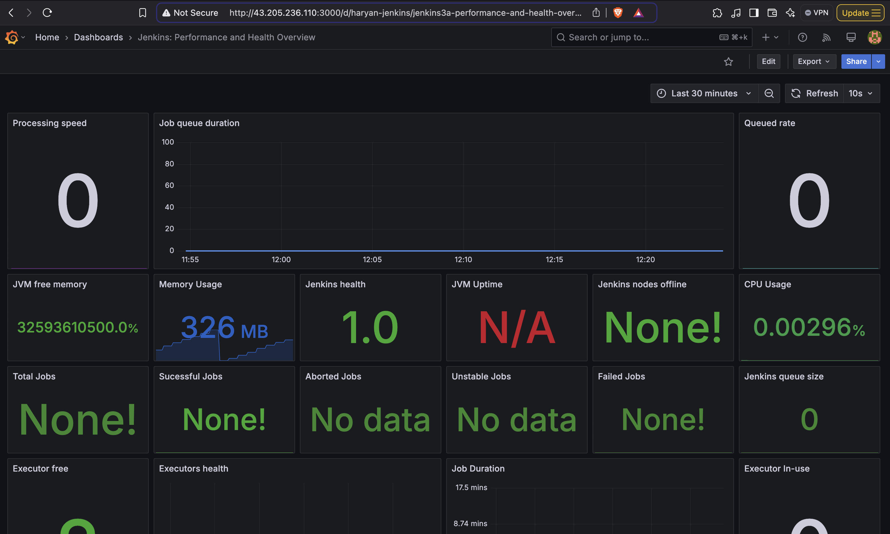

<div align="center">
  <a href="http://netflix-clone-with-tmdb-using-react-mui.vercel.app/">
    
  </a>

  <h3 align="center">Netflix Clone</h3>

  <p align="center">
    <a href="https://netflix-clone-react-typescript.vercel.app/">View Demo</a>
    ·
    <a href="https://github.com/crazy-man22/netflix-clone-react-typescript/issues">Report Bug</a>
    ·
    <a href="https://github.com/crazy-man22/netflix-clone-react-typescript/issues">Request Feature</a>
  </p>
</div>

<details>
  <summary>Table of Contents</summary>
  <ol>
    <li>
      <a href="#prerequests">Prerequests</a>
    </li>
    <li>
      <a href="#which-features-this-project-deals-with">Which features this project deals with</a>
    </li>
    <li><a href="#third-party-libraries-used-except-for-react-and-rtk">Third Party libraries used except for React and RTK</a></li>
    <li>
      <a href="#deployment">Deployment</a>
    </li>
    <li>
      <a href="#contact">Contact</a>
    </li>
  </ol>
</details>

<br />

<div align="center">
  
  <p align="center">Home Page</p>
  
  <p align="center">Mini Portal</p>
  
  <p align="center">Detail Modal</p>
  
  <p align="center">Grid Genre Page</p>
  
  <p align="center">Watch Page with customer control bar</p>
</div>

## Prerequests

- Create an account if you don't have on [TMDB](https://www.themoviedb.org/).
  Because I use its free API to consume movie/tv data.
- And then follow the [documentation](https://developers.themoviedb.org/3/getting-started/introduction) to create API Key
- Finally, if you use v3 of TMDB API, create a file named `.env`, and copy and paste the content of `.env.example`.
  And then paste the API Key you just created.

## Which features this project deal with

- How to create and use [Custom Hooks](https://reactjs.org/docs/hooks-custom.html)
- How to use [Context](https://reactjs.org/docs/context.html) and its provider
- How to use lazy and Suspense for [Code-Splitting](https://reactjs.org/docs/code-splitting.html)
- How to use a new [lazy](https://reactrouter.com/en/main/route/lazy) feature of react-router to reduce bundle size.
- How to use data [loader](https://reactrouter.com/en/main/route/loader) of react-router, and how to use redux dispatch in the loader to fetch data before rendering component.
- How to use [Portal](https://reactjs.org/docs/portals.html)
- How to use [Fowarding Refs](https://reactjs.org/docs/forwarding-refs.html) to make components reusuable
- How to create and use [HOC](https://reactjs.org/docs/higher-order-components.html)
- How to customize default theme of [MUI](https://mui.com/)
- How to use [RTK](https://redux-toolkit.js.org/introduction/getting-started)
- How to use [RTK Query](https://redux-toolkit.js.org/rtk-query/overview)
- How to customize default classname of [MUI](https://mui.com/material-ui/experimental-api/classname-generator)
- Infinite Scrolling(using [Intersection Observer API](https://developer.mozilla.org/en-US/docs/Web/API/Intersection_Observer_API))
- How to make awesome carousel using [slick-carousel](https://react-slick.neostack.com)

## Third Party libraries used except for React and RTK

- [react-router-dom@v6.9](https://reactrouter.com/en/main)
- [MUI(Material UI)](https://mui.com/)
- [framer-motion](https://www.framer.com/docs/)
- [video.js](https://videojs.com)
- [react-slick](https://react-slick.neostack.com/)

## Install with Docker

```sh
docker build --build-arg TMDB_V3_API_KEY=your_api_key_here -t netflix-clone .

docker run --name netflix-clone-website --rm -d -p 80:80 netflix-clone
```

## Deployment

### Jenkins Deployment Screenshot:


### Prometheus Deployment Screenshot:


### Grafana Deployment Screenshot:

Jenkins:-

Node Exporter:-


### SonarQube Deployment Screenshot:


### Step 1 — Launch an Ubuntu(22.04) T2 Large Instance

- Launch an EC2 instance (Ubuntu 22.04) with the T2 Large configuration.

### Step 2 — Install Jenkins, Docker, and Trivy

- Install **Jenkins** to automate the deployment.
- Install **Docker** to containerize applications.
- Install **Trivy** for vulnerability scanning in Docker images.

### Step 3 — Create a TMDB API Key

- Go to [TMDB](https://www.themoviedb.org/) and create an account.
- Follow the [documentation](https://developers.themoviedb.org/3/getting-started/introduction) to generate an API key.
- Use this key for fetching movie data in the project.

### Step 4 — Install Prometheus and Grafana On a New Server

- Install **Prometheus** and **Grafana** on a new EC2 instance to monitor the performance of the application.
- Configure Prometheus to gather metrics and use Grafana to visualize them.

### Step 5 — Install the Prometheus Plugin and Integrate It with Jenkins

- Install the **Prometheus** plugin in Jenkins.
- Integrate it with the Prometheus server for monitoring Jenkins builds.

### Step 6 — Email Integration with Jenkins and Plugin Setup

- Set up email notifications in Jenkins using the **Email Extension Plugin** for build status updates.

### Step 7 — Install Plugins Like JDK, SonarQube Scanner, NodeJS, and OWASP Dependency Check

- Install plugins for **JDK**, **SonarQube Scanner**, **NodeJS**, and **OWASP Dependency Check** for security scanning.

### Step 8 — Create a Pipeline Project in Jenkins Using a Declarative Pipeline

- Create a Jenkins pipeline using the **Declarative Pipeline** format to automate the building, testing, and deployment of the application.

### Step 9 — Install OWASP Dependency Check Plugins

- Install the **OWASP Dependency Check** plugin to check for vulnerabilities in third-party dependencies.

### Step 10 — Docker Image Build and Push

- Use Jenkins to build the Docker image and push it to Docker Hub or another registry.

### Step 11 — Deploy the Image Using Docker

- Deploy the built Docker image on the target machine using **Docker**.

### Step 12 — Access the Netflix App on the Browser

- Once deployed, access the Netflix clone on the browser using the public IP of the EC2 instance.

### Step 13 — Terminate the AWS EC2 Instances

- After completing the deployment and testing, terminate the EC2 instances to avoid unnecessary charges.

## Contact

For any questions or issues, feel free to reach out to the [repository's issue tracker](https://github.com/crazy-man22/netflix-clone-react-typescript/issues).
